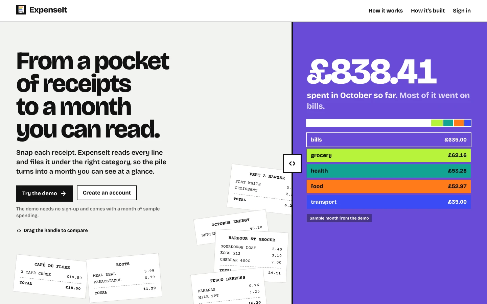
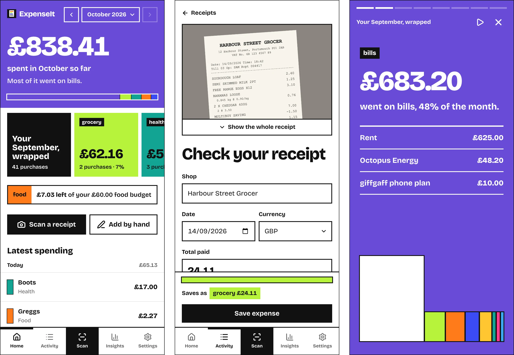
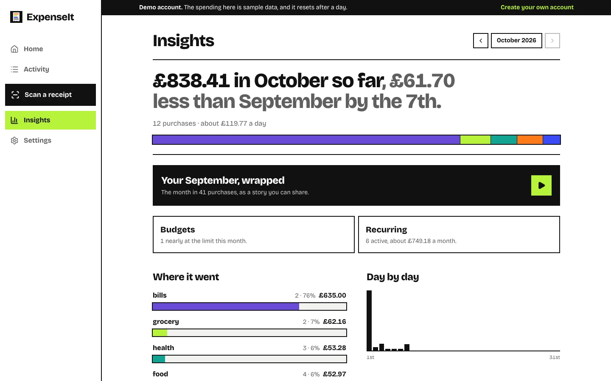
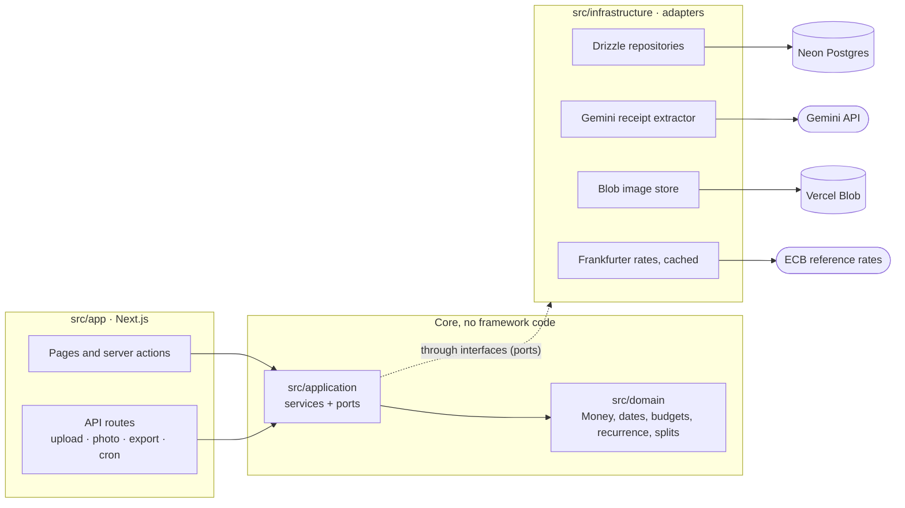

<p align="center">
  
</p>

<h1 align="center">ExpenseIt</h1>

<p align="center">
  Snap a receipt, see where your money goes.<br>
  <a href="https://expenseit-rho.vercel.app"><strong>Try the live demo</strong></a>: one click, no sign-up, sample data included.
</p>



ExpenseIt is a personal expense tracker for students and young professionals. Photograph a receipt and AI reads the shop, the date, the total and every line item. You check it, split it across categories if you like, and save it. Each month is then told back in colour: a month block on the home screen, story cards, and a full-screen recap you can tap through.

It began as my BSc final year project, a native Android app, and has been rebuilt as a web app that runs in any browser and installs on a phone like an app.



## Features

- **Receipt scanning.** Take a photo or pick one. Gemini reads the merchant, date, total and line items into a fixed JSON schema, suggests a category from your own list, and nothing is saved until you have checked it. The photo stays with the expense.
- **Split receipts.** Move items to other categories and save one expense per category. Discounts and tax are shared out in proportion, so the expenses add up to the receipt total to the penny.
- **Month in colour.** The home screen leads with the month's total on its biggest category's colour, followed by story cards and a tap-through recap of the previous month.
- **Insights.** Where it went by category, day by day, the last six months, and how this month compares with last month at the same point.
- **Budgets.** An overall monthly limit and limits per category, with warnings near (80%) and over the limit, and a month-end projection that counts recurring payments still due.
- **Recurring payments.** Rent, bills and subscriptions are logged automatically every week, month or year, with the next 30 days listed.
- **Multi-currency.** Log spending in any of the 30 currencies the European Central Bank publishes. Each expense is converted at that day's rate, and changing your home currency re-converts the history.
- **Search, filters and CSV export.** Deleting your account deletes everything, including stored photos.
- **Installable.** A web app manifest, app icons and home-screen shortcuts for Scan and Add.



## From Android to the web

Version 1 (2024/25) was a native Android app: Kotlin, Jetpack Compose, MVVM with repositories, Hilt, Room and MPAndroidChart. Receipts went through Azure AI Document Intelligence. It is preserved at the [`v1-android-fyp`](https://github.com/rui-ch67/ExpenseIt/tree/v1-android-fyp) tag.

Three things prompted the rebuild: the Azure key expired, the app only ran on Android, and trying it meant installing an Android app. Version 2 keeps the same ideas and moves them to the web:

| | v1, Android | v2, web |
| --- | --- | --- |
| Runs on | Android phones | Any browser; installs on phones as an app |
| UI | Jetpack Compose | Next.js 16 (App Router), React 19, Tailwind CSS 4 |
| Data | Room (SQLite on the phone) | Postgres on Neon, Drizzle ORM, versioned migrations |
| Receipt reading | Azure Document Intelligence, key bundled in the app | Google Gemini on the server, with fallback across three models |
| Photos | Firebase Storage, never deleted | Private Vercel Blob, served only to their owner, deleted with the receipt |
| Structure | MVVM, repositories, Hilt modules | Domain, application and infrastructure layers; a composition root plays Hilt's role |
| Accounts | None (data on one phone) | Email and password, plus a one-click demo |

Version 2 also fixes v1 bugs: deleting a category no longer deletes its expenses, editing an expense keeps its receipt, and migrations are generated from the schema instead of hand-written with a destructive fallback. Rescanning and splitting receipts, both unfinished TODOs in v1, now work.

## Architecture



Each layer depends only on the ones beneath it. Services depend on interfaces such as `ExpenseRepository` and `ReceiptExtractor`, never on Postgres or a particular API. [`src/server/container.ts`](src/server/container.ts) wires the concrete classes together, as Hilt's `AppModule` did in v1, and the tests use the same wiring with an in-memory database.

### Scanning a receipt

```
phone camera ─► browser: fix rotation, resize to 2000 px, JPEG ─► POST /api/receipts
   ─► check the daily scan limit ─► save the photo to private Blob storage
   ─► Gemini reads it into a JSON schema ─► validate ─► review screen
   ─► one expense, or one per category when items are split
```

- **No public upload.** v1 uploaded each photo to Firebase only so Azure could fetch it by URL. Gemini takes the image inline, and photos live in a private store.
- **Structured output.** The model must answer in a fixed JSON schema, with amounts as decimal strings that are validated before use. Anything unreadable is left blank for the user to fill in, rather than guessed.
- **Fallback.** Free tiers have daily quotas and busy spells, so the extractor tries `gemini-3.5-flash`, then `gemini-3.1-flash-lite`, then `gemini-3.5-flash-lite`, moving on after a refusal or a hang, all within the upload's 60 second limit. When every model is busy, the photo is kept and the user can retry or type the details in.
- **Daily limits.** 25 scans per account, 5 per demo account and 300 in total per day, enforced with atomic counters in Postgres.

### Engineering notes

- **Exact money.** Amounts are integers in minor units (pence, cents). Splitting a receipt and converting currencies use integer and BigInt arithmetic with a single, explicit rounding step (largest remainder), so totals always reconcile.
- **Ownership by construction.** Every repository method takes a `userId`, so one user can't read or change another's data.
- **Calendar dates.** Expenses store the day they happened (`2026-10-07`), not a timestamp, so month totals never shift with time zones.
- **Idempotent recurring payments.** A unique index on (rule, date) means catching up missed payments can run any number of times, from a page load or the daily cron, without logging anything twice.
- **Safe exports.** The CSV export neutralises spreadsheet formulas in user text and includes a byte-order mark so Excel opens it correctly.
- **Tests.** Vitest unit tests for the domain rules, and integration tests that run the real SQL migrations on an in-memory Postgres (PGlite), so no network or database is needed.

## Design

The interface follows a written design system, "Month in Colour" ([`DESIGN.md`](DESIGN.md)). Each category owns one flat ink and is labelled like own-brand packaging. A month's split is shown as a striped band that recurs at every size, and the month itself is told as a sequence of full-colour story cards. Product decisions and principles are in [`PRODUCT.md`](PRODUCT.md).

## Running it locally

Requirements: Node.js 22+ and pnpm.

```bash
pnpm install
cp .env.example .env.local   # then fill in the values (see comments in the file)
pnpm db:migrate              # create the tables in your database
pnpm dev                     # http://localhost:3000
```

| Script | What it does |
| --- | --- |
| `pnpm dev` | Start the development server |
| `pnpm test` | Run unit and integration tests (no database or network needed) |
| `pnpm typecheck` | Type-check the whole project |
| `pnpm lint` | Lint |
| `pnpm db:generate` | Create a migration after changing `src/infrastructure/db/schema.ts` |
| `pnpm db:migrate` | Apply pending migrations to the database in `DATABASE_URL` |
| `pnpm ocr:try <image> [model…]` | Read a receipt photo with Gemini and print what each model found |
| `pnpm smoke:receipts` | End-to-end check of scanning against the real database, Blob and Gemini (cleans up after itself) |
| `pnpm icons` | Rebuild the favicon and app icons from `docs/brand/` |
| `pnpm capture <path…>` | Screenshot pages on phone and desktop sizes, signed in as a demo user |

On Vercel, deployments run `vercel-build`, which applies pending migrations before building, so the database schema always matches the code being deployed. A daily cron job (`vercel.json`) logs due recurring payments and deletes demo accounts older than a day, along with their photos.

## Credits

Built by Rui. Typefaces: [Bricolage Grotesque](https://github.com/ateliertriay/bricolage) and [Courier Prime](https://quoteunquoteapps.com/courierprime/), both under the SIL Open Font License. Exchange rates from the European Central Bank via [Frankfurter](https://frankfurter.dev).
